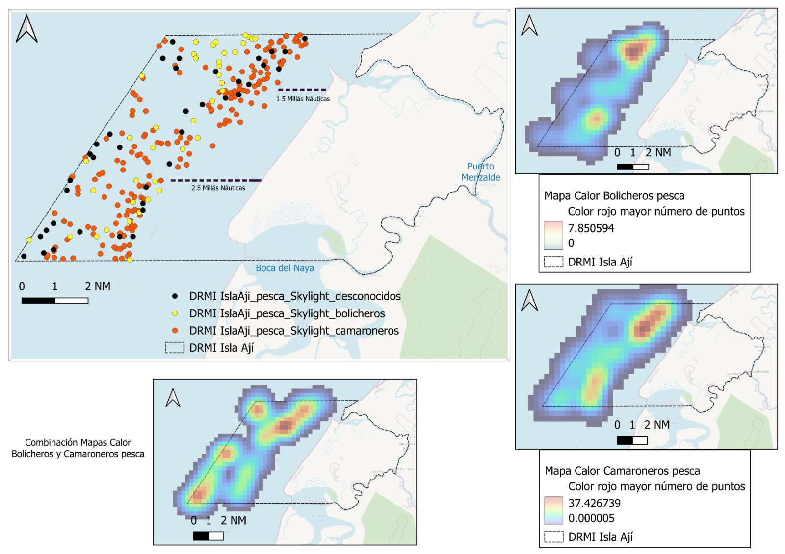

Ejercicio de visualización sobre tipos de barcos pesqueros en el área de interes
<!DOCTYPE html>
<html lang="es">
<head>
 <meta charset="UTF-8">
 <meta name="viewport" content="width=device-width, initial-scale=3.0">
 <link rel="stylesheet" href="styles.css"/>
</head>
<body>
    <header>
        <h1>Ejemplo: Presencia de barcos pesqueros utilizando la información sobre AIS</h1>
      
por: Christian Diaz 

    </header>
    <main>
        <section class="section" id="section1">
            <h2>Mapa de la Isla Ají con la presencia de embarcaciones</h2>
            
        </section>
    </main>
</body>
</html>
